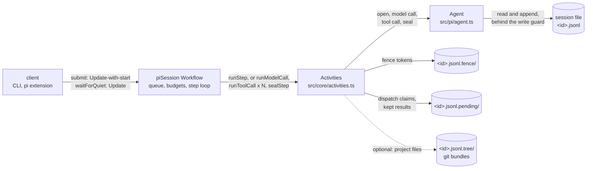

# How it fits together

The agent's session file survives a Worker crash. Temporal tracks the turn's progress and
dispatches work to another Worker. Pi is the agent here. The code in `src/core/` uses the `Agent`
interface, so you can use it with another agent.

[design-decisions.md](design-decisions.md) explains the choices behind this split.
[adapting.md](adapting.md) describes the interface your agent must implement.

## The split

The Workflow holds the control state. The agent's session file holds the conversation. Activities
do the work, and each one opens the session file again, so any Worker that can reach the file can
run the next unit.

Prompt text and final answers enter Workflow history as payloads. Error text enters history too.
Each step's input goes into history, so only the first step of a turn carries the prompt text.
Tool arguments and output stay in the session file, along with the model's other responses.

Prompts are capped at 64K characters. The answer kept in history is capped at 16K characters,
while the session file keeps the full answer. These bounds keep large tool output out of Activity
payloads. A long turn can still hit history limits, as described in
[guarantees.md](guarantees.md). Payloads can hold code or secrets. Set `PI_TEMPORAL_CODEC_KEY` to
store them encrypted.

## Reading order

| file | what to look for |
|---|---|
| `src/workflow-bundle.ts` | The two Workflows a Worker registers. |
| `src/core/workflow.ts` | `piSession`. The prompt queue, the `submit` and `waitForQuiet` Updates, `runTurn`, budgets, Continue-As-New, and the idle exit. |
| `src/core/stepped-step.ts` | One step as a model call, a tool call each, and a seal. Host queues, the fallback to the shared queue, and the recovery seal. Has no SDK imports, so `stepped-step-check` runs it with no server. |
| `src/core/activities.ts` | The Activities, for any `Agent`. Fence tokens, dispatch claims, kept results, cancellation, heartbeats, and how a Worker shutdown differs from a stop. |
| `src/core/agent.ts` | The `Agent` interface. What the Temporal side needs from an agent. |
| `src/core/fence.ts`, `src/core/pending.ts` | How a stale attempt is kept out of the session file, and how a tool runs at most once. |
| `src/core/client.ts`, `src/core/session-worker.ts` | How a prompt is sent, and how a Worker is built, with its slots, shutdown grace, and optional Worker Versioning. |
| `src/pi/agent.ts` | Pi's `Agent`. The only place that knows Pi's session format. |
| `src/worker.ts`, `src/cli.ts`, `extensions/temporal.ts` | Entry points. The standalone Worker, the CLI, and the pi extension. |

## Who owns what

| state | owner | where |
|---|---|---|
| Which prompts are queued, which turn and step run now | the Workflow | Workflow state, carried across Continue-As-New |
| The conversation, including tool output | the agent | the session file |
| Which Activity may write the session file | the Workflow, by numbering | fence tokens beside the file |
| Whether a tool call started | the first dispatch | a claim file beside the file |
| A tool's result until the seal records it | the tool call's Activity | a result file beside the file |
| The project's files, when Workers are on different hosts | the tree store, optional | git bundles beside the file |
| Session state for listing | the Workflow | the memo, and optionally the `PiSessionState` search attribute |

## Two Workflows

`piSession` is the template for a Worker session. It outlives the client, and Workers with access
to the session file can drive it.

`piLocalTurn` wraps one live turn of an open `pi` session. The turn runs in memory on a Task Queue
that only its process polls. Temporal records the turn and can retry or cancel its Activities.
The turn can't move to another process. This part supports Pi's terminal interface and lives in
`src/pi/`.

## Optional modules

The default setup uses one Worker on one Task Queue. Its `piSession` Workflow runs whole steps
through `runStep`.
You can omit the optional modules below when your agent doesn't need them.

| module | switch | needed when |
|---|---|---|
| Stepped mode | `PI_TEMPORAL_STEPPED=1` | you want a retry and timeout per tool call |
| Host queues | on with `PI_TEMPORAL_SHIP_TREE=1` | tools write a host's local files |
| Tree shipping, `src/tree/` | `PI_TEMPORAL_SHIP_TREE=1` | Workers on different hosts take turns on one project |
| Live turns, `src/pi/local-turn-*` | `PI_TEMPORAL_LIVE_TURNS` | you want a Workflow behind each live `pi` turn |
| Budgets | `PI_TEMPORAL_BUDGET_*` | a turn or session must stop at a bound |
| Schedules, `adoptProject` | `cli.ts schedule` | turns start with no client |
| Payload codec, `src/core/codec.ts` | `PI_TEMPORAL_CODEC_KEY` | history must not hold prompts in the clear |
| Tracing, `src/core/tracing.ts` | `PI_TEMPORAL_TRACING=1` | you need to see where a turn spent its time |

## Words used here

| word | meaning |
|---|---|
| turn | One prompt, from the first model call to the final answer. |
| step | One model call and the tool calls it asks for. |
| seal | The unit that writes a step's tool results into the session, in the order the model asked. |
| recovery seal | A seal after a stop or a lost host. It records what each tool reported and runs nothing new. |
| dispatch claim | A file a tool call creates before the tool can act. A retry that finds it reports an unknown outcome. |
| kept result | A tool's outcome, held beside the session file until the seal writes it. |
| unknown outcome | What the model is told about a call that may have run and left no result. |
| fence token | A number the Workflow gives each writing Activity. A higher one stops a lower one's writes. |
| host queue | A Task Queue only one Worker polls, so a step's tools and seal run where its files are. |
| tree store | The project's files as git bundles, for Workers on different hosts. |
| lease, epoch | How the tree store keeps one writer at a time, since clients write it outside any Workflow. |
